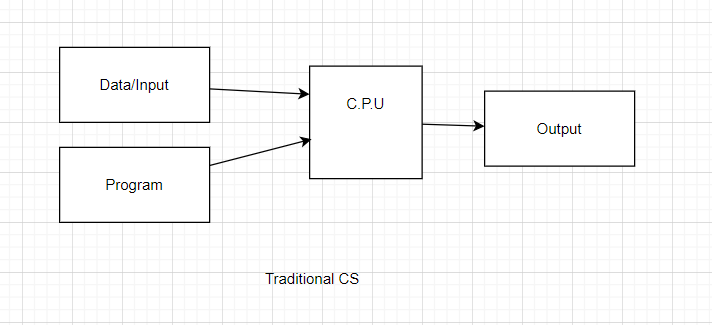
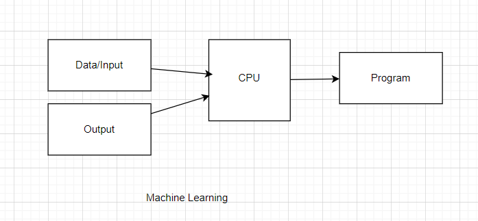
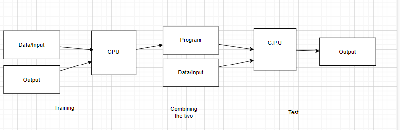

# Notes for Lecture 1: Supervised Learning Setup

## Key Concepts
- **Supervised Learning**: A type of machine learning where the model is trained on labeled data.
- **Labeled Data**: Data that includes input-output pairs (features and corresponding labels).
- **Objective**: Learn a mapping from inputs (X) to outputs (Y), this is the program you you intent to tune to get pridiction.

## History
1. 1952 Samuel's Checker Player using minmax Algorithm included simple learning. 
world champion keep defeating computer but finally computer won when world champion was in death bed and died shortly after.

2. 1957 Frank Rosenblatt invented perceptron which eventually leads to Neural network and Deep Learning. 

3. 1969, Fall of AI, where Minsky & Papert wrote a book where AI wasn't even solve simple mazes. 

4. Then a new word ML was invented to basically get funding on different name.
    a. ML works on Data and finds a program to work with new set of similar data, its more about statistics and number than logic. 
    b. AI is meant to be like us and faster more logic driven. 

5. 1994, Gerry Tesauro makes a program to play Backgammon but instead of using Min-Max algo, it let multilayer perceptron(Neural network) to play against itself for 1 night and then the program learned enough to beat him and everyone in office and later it beats world champion making a strange move which turned out to be a good move. 

6. 1997, IBM Blue deep, try to beat Gary Kasparov in chess, it lost at first but later Blue Deep defeated Gary and now in current days, Alpha Zero and Stockfish/ Leena are 3 famous chess engine which human can't even beat even if they player without timers. 

## Types of Machine learning

1) Supervised learning : You give both Question and ANswer to a System and ask system to generate pattern ( MRI Scan, Search Engine)

2) unsupervised learning : Give Data and ask system to find patterns. (Spam Filter, catagorize new article)

3) reinforement learning : To let system do something for a while and then analyse what's good and what's bad ( self driving car, auto piolet)

## Components of Supervised Learning

D = {(x1, y1), (x2, y2).... (xn, yn)} 
S = {X, Y} 
X is (R Power d) meaning X is the real number of d dimention
xi is ith result X space 

## **Y can be of many clasification**:
    - Binary clasification 
    - Multi class classification like clasifying new article into "Sport", "Tech", "Social", "Nature"
    - Regression Y is just R ( real Number , its just numbers no classifications)

1. **Input Features (X)**:
    - Represent the data points.
    - Can be numerical, categorical, or a mix.
    - Note, X is not necesarily of single dimention like 1, 2, 3. it can be N dimentional input, for example for a email filter, email is your X and it has many parameters in it, like title, body, signature, language. 

2. **Output Labels (Y)**:
    - The target variable we want to predict.
    - Can be continuous (regression) or discrete (classification).
    - for example if a Email is your X then Y can be (-1, 1) or (0, 1) representing isSpam true or false. 

3. **Model**:
    - A function or algorithm that maps inputs to outputs.
    - Example: Linear regression, decision trees, neural networks.

4. **Loss Function**:
    - Measures the error between predicted and actual outputs.
    - Common examples:
      - Mean Squared Error (MSE) for regression.
      - Cross-Entropy Loss for classification.

5. **Training Process**:
    - Optimize the model parameters to minimize the loss function.
    - Typically done using algorithms like Gradient Descent.

## Steps in Supervised Learning
1. Collect and preprocess labeled data.
2. Split data into training, validation, and test sets.
3. Choose a model architecture.
4. Train the model on the training set.
5. Evaluate the model on validation and test sets.
6. Iterate to improve performance.

## Applications
- Spam email detection (classification).
- House price prediction (regression).
- Image recognition (classification).
- Medical diagnosis (classification).

## Challenges
- Overfitting: Model performs well on training data but poorly on unseen data.
- Underfitting: Model is too simple to capture the underlying patterns.
- Data quality and quantity: Insufficient or noisy data can degrade performance.
