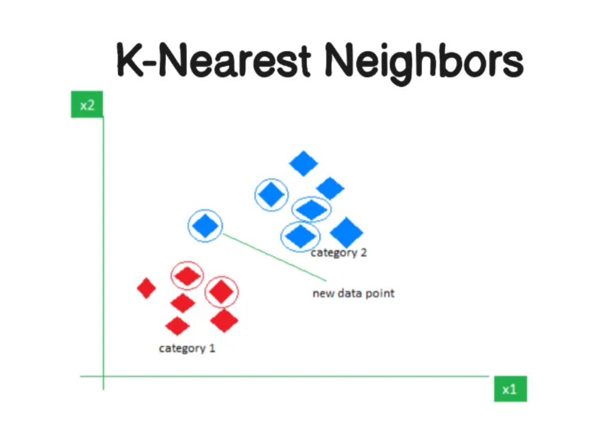

# k-Nearest Neighbors (k-NN)

## Generalization continue 
So what we want our h to work for $(x_i, y_i)$ to work any dataset which belongs to distribution P. 
$E[l(h, (x_i, y_i))]_{(x_i, y_i) \sim P}$

here 
E = Expected Loss \
h = hypothisis function \
P = distribution

so want to minimize loss where $x_i,y_i$ is out of your training set but belongs to same P, in order to achieve this you devide your test data D into $D_1$ and $D_2$ and always rememeber to split data by time if its any temporal data, be careful about making this split.

The average of our h where n = (1,∞) then it equals to our expected value, this is called **weak law of large number**
meaning \
$\frac{1}{n} \sum_{i=1}^{n} (h(x_i,y_i)) =  E[l(h, (x_i, y_i))]_{(x_i, y_i) \sim P}$ 

above equation simply means if n ~ ∞, then average of the distribution would equal expected value. 

## Defination

k-Nearest Neighbors (k-NN) is a simple, non-parametric, and lazy learning algorithm used for classification and regression tasks in machine learning. It operates by finding the `k` closest data points (neighbors) to a given input and making predictions based on their labels or values.

So the assumption that KNN makes that similar x (feature) are likely to have similar y ( label )

Above is a binary classification example with k=3
. The green point in the center is the test sample x
. The labels of the 3 neighbors are 2 times 
(+1) and 1 times -1 resulting in majority predicting (+1).
Few things are obvious:  

It's k-nearest neighbors, meaning there isn't any other neighbor to $x$ with a distance lesser than the maximum distance between $x$ and the farthest $k$-th point. If there were, we would have picked that as one of the $k$ points.  

Mathematically, this can be represented as follows:  

$$
\text{dist}(x, x') \geq \max_{(x'', y'') \in S_x} \text{dist}(x, x''),
$$  

where $S_x$ is the set of $k$ nearest neighbors of $x$, and $\text{dist}$ is the distance metric used (e.g., Euclidean, Manhattan, etc.).

We can then define the classifier $h$ as:

$$
h(x) = \text{mode}(\{y'' : (x'', y'') \in S_x\}),
$$

where $\text{mode}$ represents the most common label among the neighbors in $S_x$.

## Key Features:
- **Instance-based**: k-NN does not build a model but uses the entire dataset for predictions.
- **Distance Metric**: Common metrics include Euclidean, Manhattan, or Minkowski distance to measure similarity.
- **Parameter `k`**: The choice of `k` (number of neighbors) significantly impacts performance. Smaller `k` can lead to noise sensitivity, while larger `k` may smooth out predictions.

## Advantages:
- Simple to implement.
- Effective for small datasets with well-separated classes.

## Disadvantages:
- Computationally expensive for large datasets.
- Sensitive to irrelevant features and scaling of data.

# Minkowski Distance

Minkowski distance is a generalized metric used to measure the distance between two points in a multi-dimensional space. It is a parameterized distance metric that includes other well-known distance metrics as special cases.

The formula for Minkowski distance between two points /
$( x = (x_1, x_2, \dots, x_n) )$ and $( y = (y_1, y_2, \dots, y_n) )$ is:

$$[
d(x, y) = \left( \sum_{i=1}^{n} |x_i - y_i|^p \right)^{\frac{1}{p}}
]$$

Here:
- $( p )$ is the parameter that determines the type of distance:
    - $( p = 1 )$: Manhattan distance (L1 norm).
    - $( p = 2 )$: Euclidean distance (L2 norm).
    - $( p \to \infty )$: Chebyshev distance (maximum norm).
- $( x_i )$ and $( y_i )$ are the coordinates of the two points in the $( i )$-th dimension.

### Explanation:
- Minkowski distance is versatile because it allows you to adjust the parameter $( p \) to suit the problem at hand.
- For $( p = 1 )$, the distance is the sum of absolute differences, making it suitable for grid-like paths.
- For $( p = 2 )$, the distance is the straight-line distance, commonly used in continuous spaces.
- Larger values of $( p )$ emphasize the largest differences between dimensions.

### Example:
1. For two points $( x = (1, 2, 3) )$ and $( y = (4, 6, 8) )$:
     - If $( p = 1 )$ (Manhattan distance):
         $$
         d(x, y) = |1 - 4| + |2 - 6| + |3 - 8| = 3 + 4 + 5 = 12
         $$
     - If $( p = 2 \) (Euclidean distance):
         $$
         d(x, y) = \sqrt{(1 - 4)^2 + (2 - 6)^2 + (3 - 8)^2} = \sqrt{9 + 16 + 25} = \sqrt{50} \approx 7.07
         $$
     - If $( p = \infty \) (Chebyshev distance):
         $$
         d(x, y) = \max(|1 - 4|, |2 - 6|, |3 - 8|) = \max(3, 4, 5) = 5
         $$

2. In k-NN, the choice of $( p )$ in Minkowski distance can influence how neighbors are selected, impacting the algorithm's performance.

By adjusting $( p )$, Minkowski distance provides flexibility to adapt to different types of data and problem domains.

k-NN is widely used in applications like recommendation systems, image recognition, and anomaly detection.